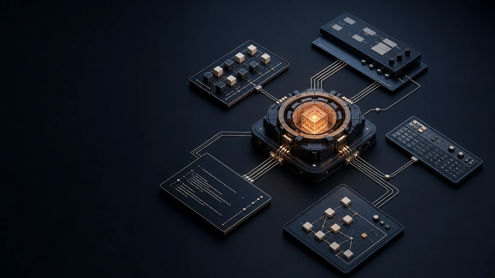
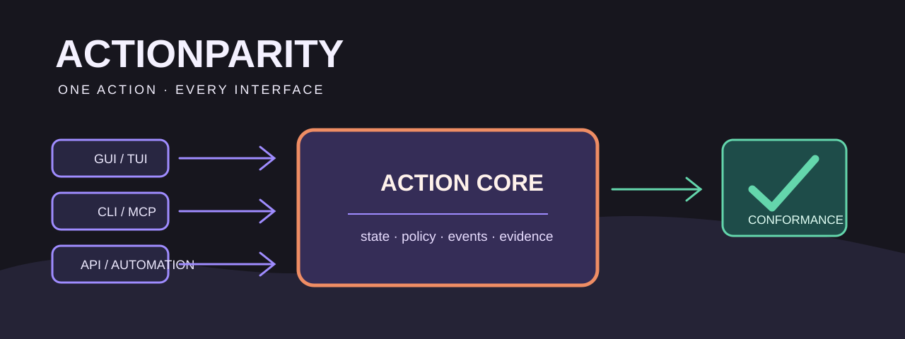

<p align="center"></p>

<h1 align="center">ActionParity (影核)</h1>

<p align="center"><strong>One action. Every interface.</strong></p>

<p align="center">
  <a href="SPEC.md">Read the specification</a> ·
  <a href="#validate-a-manifest">Validate a manifest</a> ·
  <a href="README.zh-CN.md">中文说明</a> ·
  <a href="examples/minimal/action-parity.json">Minimal example</a>
</p>

> [!IMPORTANT]
> Implement each meaningful business action once in a headless Action Core. GUI, CLI, MCP, API, automation, and tests are bindings to that core, not competing implementations.

> [!NOTE]
> **Toolchain `v0.6.2` and Manifest specification `0.5.0` are separate versions.**
> Coding agents can read both with `action-parity --version --json`; see the
> [versioning contract](docs/VERSIONING.md).

| One core owns | Every interface can do |
| --- | --- |
| State, policy, events, effects, and evidence | Discover, invoke, and assert the same action without depending on pixels. |

ActionParity (Chinese: **影核**), also known as the **ShadowCore protocol**, is an open standard for software that is equally operable by humans and AI agents.

A conforming application defines each meaningful business action once in a headless **Action Core**, then exposes that same action through the interfaces it supports: GUI, CLI, TUI, MCP, API, automation, and tests.

The GUI is not the application. The CLI is not the application. They are projections of the same action and state model.

**中文说明：** [README.zh-CN.md](README.zh-CN.md) · One standard, one name per language — see [docs/NAMING.md](docs/NAMING.md).

## Two questions, both yes or no

Software is now written and operated by AI as well as by people, and both are hard for the same reason: behavior lives inside the interface. So a second interface means writing the behavior again, and driving the application means driving pixels.

**Can it be built once?**

> A developer — human or AI — implements a behavior **once**, and the GUI, CLI, MCP, API, and test entry points follow from that single implementation instead of being written again per interface.

Writing a capability three times and keeping the copies aligned is the dominant cost of building software usable by both people and agents. AI-assisted development makes that worse, not better: generating three implementations is easy, noticing they have drifted is not.

**Can it be operated without pixels?**

> An agent that has never seen the source can **discover** what the application does, learn each behavior's inputs, outputs, effects, and risk, **invoke** it, and **assert** the result — no screenshot, no vision model, no synthetic click.

Screen-driving is the right tool for checking what a person sees, and the wrong foundation for invoking business behavior. An application that offers nothing else forces every agent onto it.

Neither question has a percentage in it.

## The invariant

> A meaningful user action MUST have one stable action identity and one canonical implementation, regardless of which interface invokes it.

ActionParity does **not** require one CLI command for every visual control. Tabs, layout toggles, drag handles, hover states, and other presentation-only interactions remain UI concerns. It requires parity for meaningful domain actions such as creating, changing, exporting, starting, stopping, diagnosing, repairing, purchasing, or deleting.

<p align="center"></p>

## Start with the Action Registry, not the Manifest

The Manifest is generated output in the runnable Rust reference implementation. Before adoption, a coding agent can inventory an unfamiliar repository without configuration:

```bash
action-parity doctor . --json
```

After adoption, it asks the repository for a compact project map:

```bash
action-parity context . --json
```

`action-parity.config.json` identifies the Registry source, generated files that must not be edited, exact generation commands, and the executable verification command. The canonical [ActionParity development Skill](skills/action-parity/SKILL.md) turns that map into the same workflow for Codex, Claude Code, and Hermes without requiring the agent to read the complete specification.

For Tauri/TypeScript projects, `action-parity generate ... --typescript` also derives Action constants, input/output types, a typed client, and a one-command Tauri transport helper. Frontend feature code imports those generated symbols instead of copying raw Action IDs from Rust.

An existing runtime Registry does not have to migrate to `action-parity-core` first. If it already exports a valid 0.5 Manifest, generate and check only the TypeScript client without replacing its CLI or MCP implementation:

```bash
action-parity generate action-parity.json --out-dir src/generated --typescript
action-parity generate action-parity.json --out-dir src/generated --typescript --check
```

The second command is read-only and exits nonzero for a missing or hand-edited client.

See the [Rust Registry example](examples/rust-registry), the [Agent Profile Schema](schema/action-parity.agent-profile.schema.json), and the [agent-native development roadmap](docs/AGENT-NATIVE-DEVELOPMENT.zh-CN.md).

## A minimal manifest

```json
{
  "$schema": "./schema/action-parity.schema.json",
  "spec_version": "0.5.0",
  "application": {
    "id": "org.example.notes",
    "name": "Example Notes",
    "version": "1.0.0"
  },
  "surfaces": [
    {
      "id": "desktop",
      "kind": "gui",
      "required_for_parity": true,
      "test_driver": "windows-uia"
    },
    {
      "id": "cli",
      "kind": "cli",
      "required_for_parity": true
    }
  ],
  "actions": [
    {
      "id": "note.create",
      "title": "Create note",
      "description": "Create and persist a note.",
      "input_schema": {
        "type": "object",
        "properties": {
          "title": { "type": "string" }
        },
        "required": ["title"]
      },
      "output_schema": {
        "type": "object",
        "properties": {
          "note_id": { "type": "string" }
        },
        "required": ["note_id"]
      },
      "effects": {
        "class": "write",
        "risk": "low",
        "reversible": true,
        "confirmation": "never",
        "audit_required": true
      },
      "execution": {
        "headless": true,
        "headless_evidence": "tests/core/note-create.test.ts",
        "idempotent": false,
        "cancellable": false,
        "timeout_ms": 5000
      },
      "bindings": [
        {
          "surface": "desktop",
          "target": "NewNoteButton",
          "test": "tests/ui/create-note.spec.ts"
        },
        {
          "surface": "cli",
          "target": "notes note create --title <text> --json",
          "test": "tests/cli/create-note.test.ts"
        }
      ]
    }
  ]
}
```

See the complete [normative draft](SPEC.md), the [minimal example](examples/minimal/action-parity.json), and the [U-King pilot manifest](examples/u-king/action-parity.json).

## What a shadow may not contain

Conformance is binary and it lives in four rules. A Surface — a **shadow** of the core — must not contain:

1. **a second implementation** of a behavior;
2. **a policy decision that exists only there** — a destructive action guarded only by a dialog in the front end is unguarded the moment a second shadow appears;
3. **an independent source of truth** for state;
4. **an action reachable only through that shadow**.

Presentation, input collection, and platform integration are what a shadow is *for*. Behavior is not.

A validator reports violations and their locations. It does not grade:

```text
Shadow desktop   gui/in-process     6 action(s)   6 proven   checked
Shadow cli       cli/external       6 action(s)   6 proven   checked
Shadow mcp       mcp/local-ipc      6 action(s)   6 proven   checked

Violations   0
Unproven     0
```

An application whose only non-visual surface is its own webview command bridge (`#[tauri::command]`, `ipcRenderer`, and equivalents) has a private calling convention, not machine access — it violates rule 4. [`examples/gui-only`](examples/gui-only/action-parity.json) is kept as the regression case.

**Graded levels are optional.** AP-1 through AP-4 and the coverage percentages that support them are an audit profile, not the standard: see [docs/AUDIT-PROFILE.md](docs/AUDIT-PROFILE.md), including [why they were moved out](docs/AUDIT-PROFILE.md#why-this-was-moved-out-of-the-specification). An implementation can conform completely and never produce a score.

## Validate a manifest

Requires Node.js 20 or newer.

```bash
npm install
npm test
node bin/action-parity.mjs validate examples/minimal/action-parity.json
node bin/action-parity.mjs report examples/u-king/action-parity.json --json
node bin/action-parity.mjs doctor . --json
node bin/action-parity.mjs context examples/rust-registry --json
node bin/action-parity.mjs verify examples/rust-registry/generated/action-parity.json --json
```

The CLI follows agent-friendly conventions:

- stdout contains result data;
- stderr contains progress and diagnostics;
- `--json` produces a stable machine-readable envelope;
- exit codes are `0` success, `1` conformance/runtime failure, and `2` invalid usage.

## How this differs from adjacent standards

ActionParity composes existing standards instead of replacing them.

| Existing work | What it solves | What ActionParity adds |
|---|---|---|
| MCP | Agent tool discovery and invocation | A requirement that human and agent surfaces share the same application action |
| OpenAPI / OpenRPC | Machine-readable service interfaces | Local/native application parity and GUI bindings |
| WebDriver / Appium / Windows UI Automation | Real UI inspection and control | Stable domain semantics below the UI |
| AgentReady | End-to-end agent usability for web products | Native/desktop Action Core and interface conformance |
| ANIP | Governed, risk-aware agent service calls | Human GUI mapping and application-level parity |
| AG-UI / ggui | Agent-to-user interface communication or generated UI | Existing application behavior parity |
| Tauri Commands / Blender Operators / App Intents | Useful implementation primitives | Cross-framework requirements, schemas, reports, and certification |

Read the evidence and detailed comparison in [docs/LANDSCAPE.md](docs/LANDSCAPE.md).

## Project status

**Toolchain v0.6.2; Manifest specification 0.5.0.** The repository includes a runnable Rust Action Registry, deterministic Manifest/CLI/MCP/TypeScript generation, executable Binding evidence, and an Agent Profile/Skill for coding-tool discovery. Installable npm tarballs are available from [GitHub Releases](https://github.com/dongsheng123132/action-parity/releases); publication to npm and crates.io is still pending, so those registry coordinates must not yet be claimed as available. Follow the [release gate](docs/RELEASING.md) for exact channel status. The SDK and conformance language remain open to revision before v1.0.

The real-project baseline now covers Redline, Zhaozuo, and U-King. The [merged U-King pilot](https://github.com/dongsheng123132/u-king-mini/pull/315) generates a 46-Action Manifest and typed client from its existing Rust core, verifies 46 CLI and 21 honest GUI bindings, and checks drift from a clean Linux checkout. Redline tests gradual adoption around an existing Rust dispatcher; Zhaozuo tests the honest compatibility path for third-party GUIs.

- a headless Action Core;
- CLI and MCP adapters;
- Windows UI Automation coverage;
- binding and parity reports;
- safe, sandboxed AI-driven tests.

See the [measured real-project baseline (Chinese)](docs/REAL-PROJECT-BASELINE.zh-CN.md) and [docs/U-KING-PILOT.md](docs/U-KING-PILOT.md).

## Participate

- Read and challenge the [specification](SPEC.md).
- Propose a requirement through the [RFC process](CONTRIBUTING.md).
- Add an implementation report for a real application.
- Build an adapter for Electron, Tauri, .NET, Swift, Python, or another ecosystem.
- Join the adoption plan in [docs/ADOPTION.md](docs/ADOPTION.md).

ActionParity is intended to become community-governed infrastructure. The specification, schemas, validator, and reference adapters will remain open.

Read the short [ActionParity Manifesto](MANIFESTO.md) and the practical [launch playbook](docs/LAUNCH.md).

## Commercial ecosystem

An open standard can support a healthy commercial ecosystem without making conformance pay-to-play. Potential businesses include managed CI, independent certification, migration tooling, enterprise policy and audit, conformance labs, training, and adapter support.

The proposed model and neutrality safeguards are documented in [docs/BUSINESS.md](docs/BUSINESS.md).

## License

Apache License 2.0. See [LICENSE](LICENSE).
